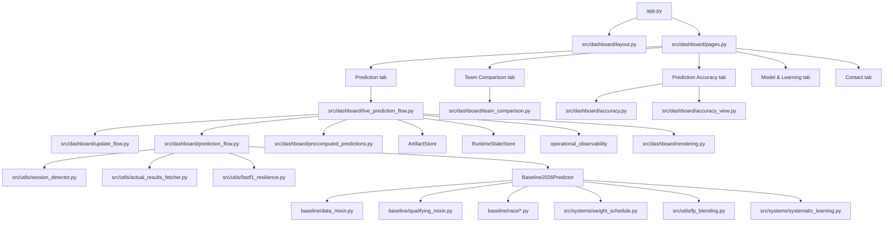

# F1 2026 Prediction System Architecture

## Runtime Overview

The dashboard shell starts in `app.py`, applies layout/navigation in `src/dashboard/layout.py`,
and routes in `src/dashboard/pages.py`. The user-facing tab is named `Prediction`, but the
implementation still runs through `render_live_prediction_page()` and
`src/dashboard/live_prediction_flow.py`.



`src/predictors/qualifying.py` and `src/predictors/race.py` are compatibility wrappers; they call the baseline predictor internally.

## Dashboard Modules

- `src/dashboard/cache.py`: FastF1 cache setup, artifact version tracking, cached predictor loading.
- `src/dashboard/layout.py`: page config, CSS/theme injection, header, sidebar controls.
- `src/dashboard/pages.py`: page routing for `Prediction`, `Team Comparison`, `Prediction Accuracy`, `Model & Learning`, and `Contact`.
- `src/dashboard/live_prediction_flow.py`: refresh orchestration, boundary checks, cache-keying, cache-hit FastF1 rechecks.
- `src/dashboard/prediction_flow.py`: cached weekend prediction cascade + ACTUAL/PREDICTED grid switching.
- `src/dashboard/precomputed_predictions.py`: artifact keying and storage for warmed prediction payloads and base features.
- `src/dashboard/rendering.py`: qualifying/race result tables and race-specific visual sections.
- `src/dashboard/update_flow.py`: auto-update hooks for completed races and FP practice capture.
- `src/dashboard/team_comparison.py`: standalone team profile comparison tab.
- `src/dashboard/accuracy.py`: target-aware accuracy pipeline built from saved predictions and actuals.
- `src/dashboard/accuracy_view.py`: charts, KPIs, and saved-prediction summaries for the accuracy tab.

## Core Components

### 1. Baseline Predictor

Entry file: `src/predictors/baseline_2026.py`  
Composed implementation:
- `src/predictors/baseline/data_mixin.py`
- `src/predictors/baseline/qualifying_mixin.py`
- `src/predictors/baseline/race/params_mixin.py`
- `src/predictors/baseline/race/preparation_mixin.py`
- `src/predictors/baseline/race/prediction_mixin.py`

Responsibilities:

- Load team, driver, and track data.
- Build blended team strength (baseline/testing/current).
- Predict qualifying (Monte Carlo, median position output).
- Predict race (lap-by-lap Monte Carlo with pit strategy + degradation model).

### 2. Weight Schedule

File: `src/systems/weight_schedule.py`

Responsibilities:

- Blend three signals:
  - baseline capability,
  - testing directionality modifier,
  - current season performance.
- Shift trust toward current season quickly in regulation-change mode.

### 3. FP Blending

File: `src/utils/fp_blending.py`

Responsibilities:

- Pull best available session performance by weekend type.
- Convert lap times to relative team performance.
- Blend session pace with model strength.
- Fall back to testing short-run profile blend when weekend practice pace is unavailable.
- Fall back to model-only path when both practice and testing fallback are unavailable.

Note: the active baseline path does not use a fixed 70/30 split. `BaselineQualifyingMixin`
scales the practice share by data confidence using
`baseline_predictor.qualifying.fp_blend_weight*` bounds in `config/default.yaml`.

### 4. Auto Update From Completed Races

Files:

- `src/utils/auto_updater.py`
- `src/systems/updater.py`
- `scripts/update_from_race.py`

Responsibilities:

- Detect completed races.
- Update `current_season_performance` and related metadata.
- Keep baseline and testing directionality separate from in-season updates.
- Persist updates through `ArtifactStore` (with mode-dependent DB/file behavior).

### 5. Testing/Practice Directionality Updater

Files:

- `src/systems/testing_updater.py`
- `scripts/update_from_testing.py`
- `src/dashboard/update_flow.py` (FP auto-capture entry)

Responsibilities:

- Explicit/manual extraction of directional car metrics from testing and practice data.
- Supports testing and practice sessions.
- Writes updated directionality fields to car characteristics.
- Also used automatically for completed FP sessions via dashboard practice-capture flow.

### 6. Persistence Layer

Files:

- `src/persistence/artifact_store.py`
- `src/persistence/config.py`
- `src/persistence/db.py`
- `src/persistence/runtime_state_store.py`
- `src/utils/operational_observability.py`
- `migrations/001_create_artifacts_table.sql`
- `migrations/002_create_runtime_state_and_operational_tables.sql`

Responsibilities:

- Provide unified artifact load/save interface.
- Persist runtime state and processing locks for idempotent practice backlog updates.
- Emit runtime counters and alerts to `operational_events`.
- Support storage modes controlled by `USE_DB_STORAGE`:
  - `file_only` (default),
  - `db_only`,
  - `fallback`,
  - `dual_write`.
- Allow Supabase rollout while keeping local-file fallback paths.

### 7. Systematic Learning Calibration

Files:

- `src/systems/systematic_learning.py`
- `src/utils/prediction_logger.py`

Responsibilities:

- Update per-driver and teammate-gap EMA error state from prediction records with actual results.
- Persist adaptive calibration state in `data/learning_state.json`.
- Expose bounded learned position adjustments for qualifying and race scoring paths.

## Data Model

### Car characteristics

File: `data/processed/car_characteristics/2026_car_characteristics.json`

Per team:

- `overall_performance` (baseline)
- `directionality` (testing/practice-derived directional metrics)
- `current_season_performance` (list of in-season values)
- `uncertainty`

### Track characteristics

File: `data/processed/track_characteristics/2026_track_characteristics.json`

Contains track profile and overtaking difficulty used by qualifying/race modeling.

### Driver characteristics

File: `data/processed/driver_characteristics.json`

Contains racecraft, pace, experience, and DNF-related inputs.

## Qualifying Flow

```text
load lineups
  -> blended team strength (weight schedule)
  -> optional session performance blend (FP or sprint session priority)
  -> combine team + driver skill
  -> Monte Carlo simulations
  -> median grid + confidence
```

## Race Flow

```text
input grid (predicted or actual)
  -> prepare driver/team context (including per-compound strengths)
  -> generate Monte Carlo pit strategies
  -> simulate lap-by-lap race dynamics
  -> include DNF, lap1 chaos, strategy, safety car effects
  -> aggregate positions and strategy distributions across simulations
  -> final finish order + confidence + podium probability
```

## Session/Weekend Handling

File: `src/utils/weekend.py`

- Uses FastF1 event format to determine sprint vs conventional weekend.
- Falls back to local track characteristics when schedule cannot be fetched.

## Caching

- Primary FastF1 cache: `data/raw/.fastf1_cache`
- Testing updater cache (default): `data/raw/.fastf1_cache_testing`
- Streamlit cache is invalidated when tracked artifact versions or key file timestamps change.
- Live prediction cache is invalidated on event-boundary signature changes and competitive-session refresh deltas.

## Notes On Legacy Components

- Bayesian ranking modules still exist and are testable.
- `src/systems/learning.py` remains a legacy/experimental path.
- Active dashboard calibration uses `src/systems/systematic_learning.py`.
