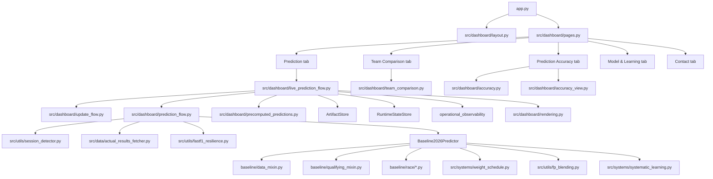

# Architecture

## Why It's Structured This Way

The core constraint is data scarcity that changes race by race. At the start of
the season there is almost no signal — just pre-season testing. By mid-season
there are race results, practice sessions, and compound performance data for
each circuit visited so far.

That progression drives three structural choices:

**The predictor is signal-blending, not model-training.** There's not enough
data to train a meaningful ML model mid-season. Instead, the system blends
three explicit signals (baseline, testing directionality, in-season performance)
with a race-number-aware weight schedule. This makes the uncertainty explicit
and the trust shift auditable.

**The dashboard request path is read-only.** All prediction artifacts are
pre-generated by background workers. The dashboard loads warmed predictions.
This separates freshness management from user-facing latency.

**Artifact persistence is mode-switchable.** During local development everything
is file-backed. In production on Render, artifacts persist to Supabase with
fallback to files. The same code runs in both modes through `ArtifactStore`.

---

## Runtime Overview



`src/predictors/qualifying.py` and `src/predictors/race.py` are compatibility
wrappers that delegate to `Baseline2026Predictor` internally.

---

## Dashboard Modules

- `src/dashboard/cache.py`: FastF1 cache setup, artifact version tracking, cached predictor loading.
- `src/dashboard/layout.py`: page config, CSS/theme injection, header, sidebar controls.
- `src/dashboard/pages.py`: page routing for all tabs.
- `src/dashboard/live_prediction_flow.py`: refresh orchestration, boundary checks, cache-keying.
- `src/dashboard/prediction_flow.py`: cached weekend prediction cascade + ACTUAL/PREDICTED grid switching.
- `src/dashboard/precomputed_predictions.py`: artifact keying and storage for warmed prediction payloads.
- `src/dashboard/rendering.py`: qualifying/race result tables and race-specific visual sections.
- `src/dashboard/update_flow.py`: auto-update hooks for completed races and FP practice capture.
- `src/dashboard/team_comparison.py`: standalone team profile comparison tab.
- `src/dashboard/accuracy.py`: target-aware accuracy pipeline built from saved predictions and actuals.
- `src/dashboard/accuracy_view.py`: charts, KPIs, and saved-prediction summaries for the accuracy tab.

---

## Core Components

### 1. Baseline Predictor

Entry: `src/predictors/baseline_2026.py`

Composed from focused mixins:
- `src/predictors/baseline/data_mixin.py` — artifact loading, blended team strength, compound helpers
- `src/predictors/baseline/qualifying_mixin.py` — qualifying and sprint-qualifying flow
- `src/predictors/baseline/race/params_mixin.py` — race parameter resolution
- `src/predictors/baseline/race/preparation_mixin.py` — driver/team context, compound selection
- `src/predictors/baseline/race/prediction_mixin.py` — lap-by-lap Monte Carlo simulation

### 2. Weight Schedule

File: `src/systems/weight_schedule.py`

Blends baseline, testing, and current-season signals. In regulation-change mode
(`extreme` schedule), trust shifts to current-season data aggressively: Race 1
starts at 50% current, Race 3+ runs at 95% current. See
`docs/WEIGHT_SCHEDULE_GUIDE.md` for the full progression table.

### 3. FP Blending

File: `src/utils/fp_blending.py`

Builds a qualifying prediction from available session data. Blend weight is
confidence-adjusted, not fixed — more sessions and cleaner data means more
session trust relative to model strength. Falls back through testing profile
blend to model-only when session data is unavailable.
See `docs/FP_BLENDING_SYSTEM.md`.

### 4. Auto Update From Completed Races

- `src/utils/auto_updater.py`
- `src/systems/updater.py`
- `scripts/update_from_race.py`

Detects completed races, updates `current_season_performance`, keeps baseline
and testing directionality separate from in-season updates.

### 5. Testing/Practice Directionality Updater

- `src/systems/testing_updater.py`
- `scripts/update_from_testing.py`
- `src/dashboard/update_flow.py` (FP auto-capture entry)

Extracts directional car metrics from testing and practice sessions. Writes
updated directionality fields to car characteristics. FP sessions are captured
automatically via the dashboard update flow.

### 6. Persistence Layer

- `src/persistence/artifact_store.py`
- `src/persistence/config.py`
- `src/persistence/db.py`
- `src/persistence/runtime_state_store.py`
- `src/utils/operational_observability.py`

Unified artifact load/save interface across storage modes (`file_only`,
`fallback`, `dual_write`, `db_only`). Persists runtime state and processing
locks for idempotent practice backlog updates. Emits counters and alerts to
`operational_events`.

### 7. Systematic Learning Calibration

- `src/systems/systematic_learning.py`
- `src/utils/prediction_logger.py`

Updates per-driver and teammate-gap EMA error state from stored prediction
records vs actual results. Bounded learned adjustments are consumed by
qualifying and race scoring on the next prediction cycle.

---

## Data Model

### Car characteristics

`data/processed/car_characteristics/2026_car_characteristics.json`

Per team:
- `overall_performance` — baseline capability
- `directionality` — testing/practice-derived directional metrics
- `current_season_performance` — list of in-season values (running mean used as `current` signal)
- `uncertainty`
- `compound_characteristics` — per-compound pace and degradation metrics by circuit

### Track characteristics

`data/processed/track_characteristics/2026_track_characteristics.json`

Track profile, overtaking difficulty, and track-specific pit loss used by
qualifying and race modeling.

### Driver characteristics

`data/processed/driver_characteristics.json`

Racecraft, pace, experience, and DNF-related inputs.

---

## Qualifying Flow

```text
load lineups
  → blended team strength (weight schedule)
  → confidence-scaled session pace blend (FP or sprint sessions)
  → combine team + driver skill
  → Monte Carlo simulations
  → median grid position + confidence bands
```

## Race Flow

```text
qualifying grid (actual or predicted)
  → per-driver compound strengths from session history
  → Monte Carlo pit strategy generation (FIA 2-compound rule enforced)
  → lap-by-lap simulation:
      tire degradation (compound-specific slopes)
      fuel load effect
      fresh tire advantage window
      traffic position correction
      track-specific pit loss
      safety car, lap-1 chaos, DNF probability
  → aggregate across simulations
  → finish order + strategy distribution + podium probability
```

---

## Caching

- Primary FastF1 cache: `data/raw/.fastf1_cache`
- Testing updater cache: `data/raw/.fastf1_cache_testing`
- Streamlit cache invalidated on artifact version changes and competitive-session refresh deltas.
- Live prediction cache invalidated on event-boundary signature changes.

---

## Notes On Legacy Components

- Bayesian ranking modules exist and are testable but are not in the active dashboard path.
- `src/systems/learning.py` is a legacy/experimental path.
- Active calibration uses `src/systems/systematic_learning.py`.
