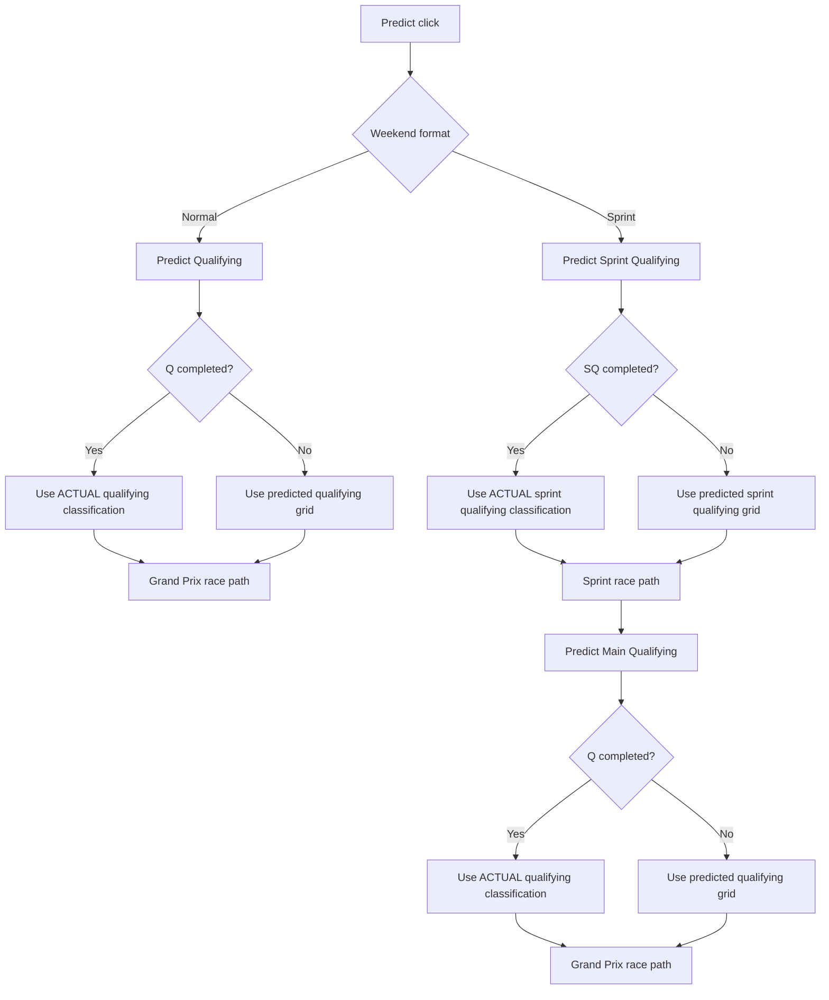

# Weekend Prediction Flow

This is the dashboard prediction cascade behind `src/dashboard/pages.py` and `app.py`.

## Flow

The app produces a cascade of predictions based on weekend format.

- Normal weekend: 2 outputs
- Sprint weekend: 4 outputs

The race model can use ACTUAL grids from completed competitive sessions when available.
That is deliberate: after `Q`, the main qualifying target is closed, but the
Grand Prix race target may use the actual qualifying classification as its
starting-grid input.

If session completion state is unknown, the flow stops for that session instead of silently switching back to predicted data.

## Normal Weekend

Flow:

1. Qualifying prediction
2. Race prediction

Process:

- Predict qualifying grid.
- If qualifying session is already complete and results are available, replace predicted grid with ACTUAL qualifying results.
- Predict race from that grid.

Tracked accuracy targets on a normal weekend:

- `main_qualifying`
- `grand_prix_race`

Checkpoint coverage:

- `main_qualifying`: `PRE -> FP1 -> FP2 -> FP3`
- `grand_prix_race`: `PRE -> FP1 -> FP2 -> FP3 -> Q`

## Sprint Weekend

Flow:

1. Sprint Qualifying prediction
2. Sprint Race prediction
3. Main Qualifying prediction
4. Main Race prediction

Process:

- Predict Sprint Qualifying.
- Sprint Race uses Sprint Qualifying grid (ACTUAL if available, otherwise predicted).
- Predict Main Qualifying.
- Main Race uses Main Qualifying grid (ACTUAL if available, otherwise predicted).

Tracked accuracy targets on a sprint weekend:

- `sprint_qualifying`
- `sprint_race`
- `main_qualifying`
- `grand_prix_race`

Checkpoint coverage:

- `sprint_qualifying`: `PRE -> FP1`
- `sprint_race`: `PRE -> FP1 -> SQ`
- `main_qualifying`: `PRE -> FP1 -> SQ -> Sprint`
- `grand_prix_race`: `PRE -> FP1 -> SQ -> Sprint -> Q`

## ACTUAL vs PREDICTED Grid Source

Grid source is resolved in `fetch_grid_if_available()` in `src/dashboard/prediction_flow.py`.

- `ACTUAL`: completed competitive session results were fetched.
- `PREDICTED`: session is not yet complete, so model output is used.

If completion state is `unknown`, the flow fails closed for that session instead of silently falling back.

Competitive sessions checked for grid replacement:

- `SQ` (Sprint Qualifying)
- `Q` (Main Qualifying)

## Practice Data Use In This Flow

Practice/session blending is used in qualifying prediction through `Baseline2026Predictor.predict_qualifying()`.

Important details:

- The predictor builds a short-stint weighted blend from available sessions.
- If weekend practice pace is unavailable, it can use a testing short-run profile fallback.
- If both are unavailable, qualifying runs in model-only mode.

Session blend inputs from `src/utils/fp_blending.py`:

- Normal weekend: `FP3 + FP2 + FP1` (FP3-weighted)
- Sprint weekend (main qualifying): `Sprint Qualifying + FP1 + Sprint`

When no weekend practice data exists:

- `predict_qualifying()` sets `data_source` to `Testing short-run profile blend (no weekend practice data)` if fallback is available.
- Otherwise `data_source` is `Model-only (no practice/testing data)`.

In model-only mode, the qualifying stack also applies teammate/experience stabilization and learned calibration nudges.

## Sprint Race Adjustments

Sprint race prediction calls `predict_race(..., is_sprint=True)`.

Current sprint adjustments in baseline predictor:

- lower chaos level,
- extra grid weight influence.
- race still uses track-aware overtaking and strategy timing bias inputs.

Grand Prix race and sprint race should be evaluated separately. They share much
of the simulation stack, but grid anchoring, overtaking difficulty, pit strategy,
and race length create different error profiles.

## Prediction Tracking Integration

When tracking is enabled in the Settings expander:

- one prediction artifact is saved per detected completed session,
- dashboard flow enforces max one save per race/session key,
- each saved checkpoint can persist multiple forecastable targets,
- later-session ACTUAL results only exclude the contaminated target, not every target by default,
- sprint weekends can carry sprint-target and main-weekend-target forecasts side by side.

Storage backend depends on `USE_DB_STORAGE` (`file_only`, `db_only`, `fallback`, `dual_write`).

See `docs/PREDICTION_TRACKING.md` for file structure and update workflow.

Saved artifacts may also include `shadow_challengers` for target-specific
background candidates. These are audit outputs only and do not replace the
champion prediction shown by the dashboard.

## Accuracy Outputs

The dashboard Prediction Accuracy page now separates two questions that used to be mixed together:

- how accuracy changes over the weekend
- how accuracy changes over the season

Weekend progression charts:

- split by target
- split again into normal weekends and sprint weekends
- x-axis is checkpoint order for that target

Season trend charts:

- split by target
- split again into normal weekends and sprint weekends
- x-axis is race round or date through the season
- one line per checkpoint

Headline charts focus on:

- `main_qualifying`
- `grand_prix_race`

Sprint-only targets remain available as secondary drilldowns.

## Known Limits

1. ACTUAL grid replacement depends on FastF1 data availability.
2. If completion status is unknown, prediction generation for that session is blocked until status can be resolved.
3. Weekend format detection depends on FastF1 event schedule (with local fallback in utilities).
4. Historic sprint weekends may have genuine gaps for early main `Q/R` targets if those target forecasts were never stored at the time.
